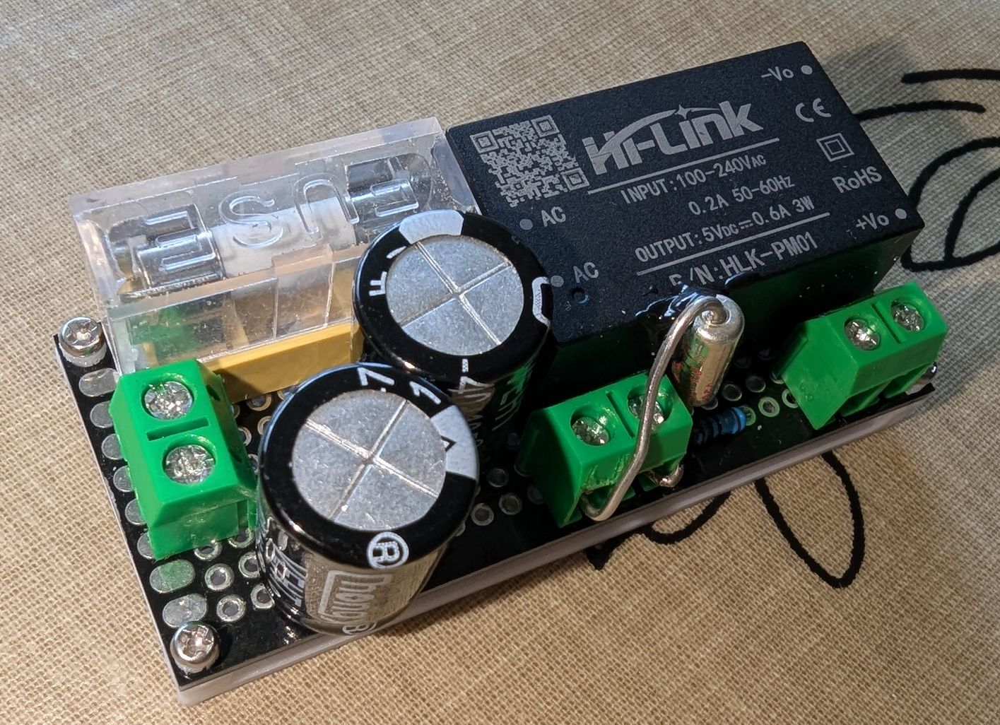
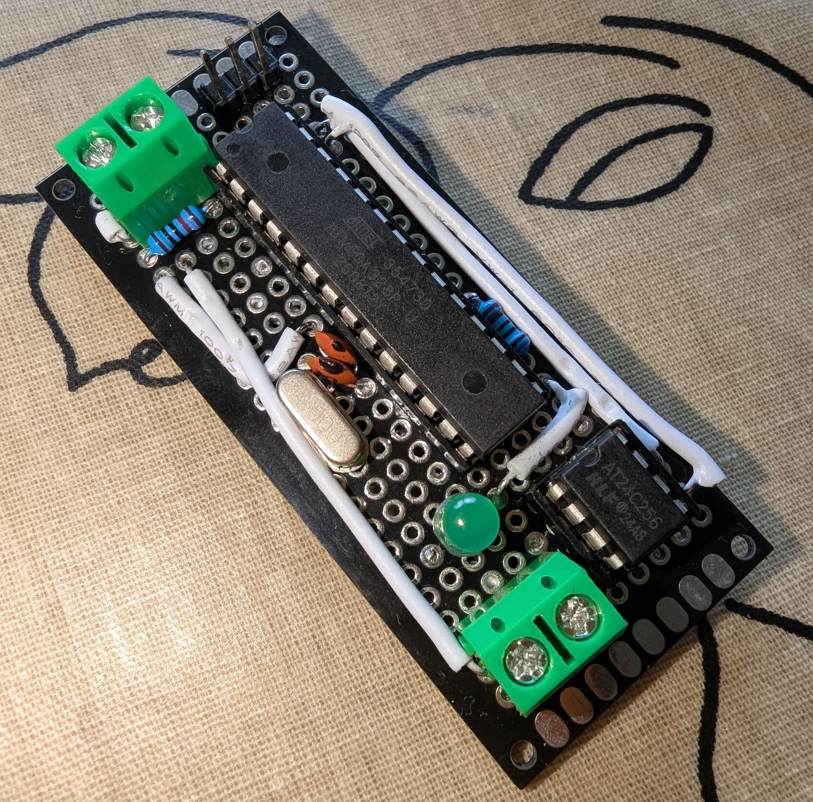
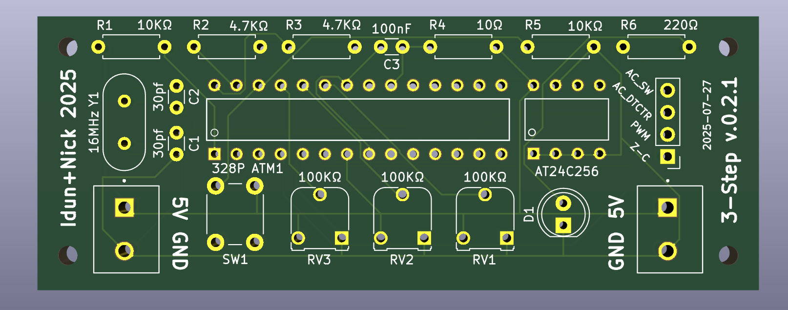
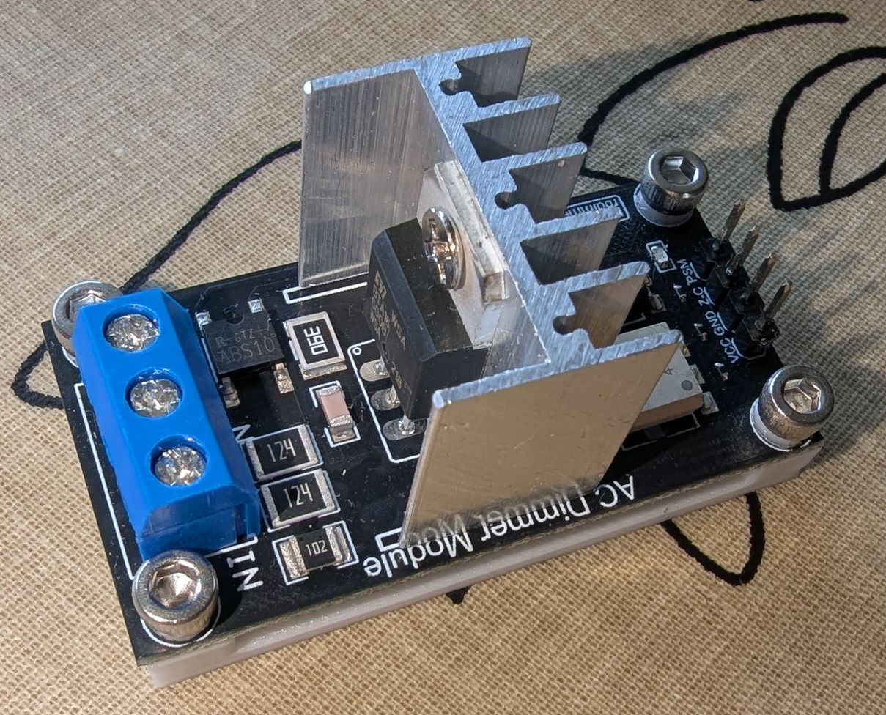
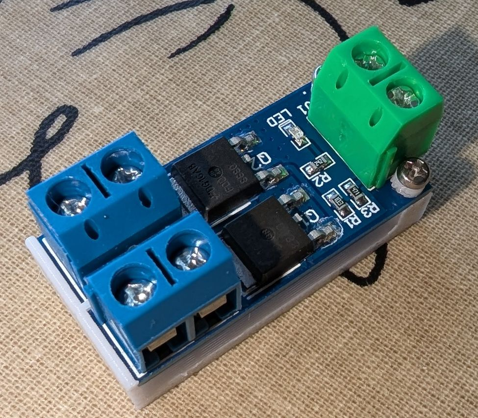
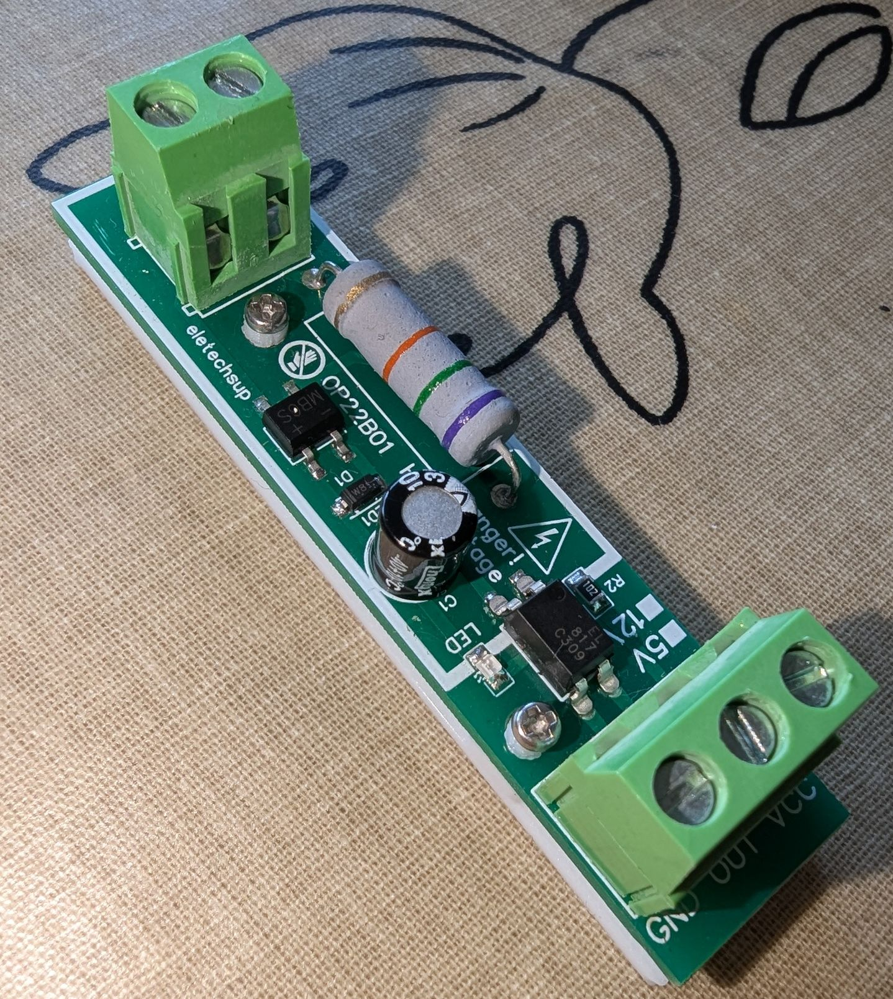

# Parts List

This file covers the parts required for both v0.1, v0.2, and the power supply.

An asterisk denotes parts optional, but recommended. Links are non-affiliate AliExpress Links. I cannot guarantee that these will remain online, and I will not actively update them.

### General Purpose
These are "universal" parts you will need either way, so I will list them here. I will not add links because they are easy enough to find
- Solid Core Wire (both for soldering and connecting between terminal connectors
- GPIO Jumper Cables. Recommend you get Male to Male, Male to Female, and Female to Female. 
- Solder (duh)
- Flux/Rosin
- "Wire solder holder" (for lack of better description) Highly recommended because you'll likely solder gpio cables to thicker ones
  https://www.aliexpress.com/item/1005009535618361.html
- Stranded Wire rated for 240V 
- M2 and M3 Brass Screw inserts (M3 only needed for the RBDimmer. You can use M2 as well and use 3D-printed washers)

### V0.2 PCB
You have many options of ordering your PCB. I went with PCBWay because they offer IOSS (EU Vat prepaid) shipping methods, which is essential for delivery to where I live. Should you also choose PCBWay and have not ordered with them before, I would appreciate if you signed up using my referral link. You will get \$5 off on your first order, I get \$10 in coupons. That's all there's to it. [Click here <3](https://pcbway.com/g/Qr5ZNd)

### Power Supply

| Qty                | Part                               | Link                                                  |
|--------------------|------------------------------------|-------------------------------------------------------|
| 1                  | 30x70mm Prototyping Board          | https://www.aliexpress.com/item/1005009550650037.html |
| 1                  | HLK-PM01 Power Supply Unit         | https://www.aliexpress.com/item/1005007038304937.html |
| 2 (3*)1 | KF301 2 Pin Terminal Connector     | https://www.aliexpress.com/item/1005006642865467.html |
| 2                  | 4700µF 10V Electrolytic Capacitors | https://www.aliexpress.com/item/1005008896677668.html |
| 1*                 | 5x20mm 250V 0.5A Slow-Blow Fuse    | https://www.aliexpress.com/item/32871909497.html      |
| 1*                 | 5x20mm Fuse Holder                 | https://www.aliexpress.com/item/1005005645173789.html |
| 1*1     | 73° Thermal Fuse                   | https://www.aliexpress.com/item/1940867762.html       |
| 1                  | 10Ω Resistor                       | https://www.aliexpress.com/item/1005009329218922.html |

**Notes**

1. A third terminal connector I have used to mount the Thermal fuse. This is not good practice and you should probably use a connector made for these fuses.
   Do not make the same mistake as I and try to solder them. Turns out thermal fuses blow when they get hot. ;)

**Instructions**

- Fuses are in Series with the live line of your input. Their order should not matter, as the thermal fuse can handle 10A.
- Capacitors are in parallel with the HLK-PM01 output lines.
- The Resistor is in Series with the HLK-PM01's VCC output line after the caps.
- Use silicon rubber thermal glue to attach the thermal fuse to the HLK-PM01.

### v0.1

| Qty                | Part                             | Link                                                  |
|--------------------|----------------------------------|-------------------------------------------------------|
| 1                  | 30x70mm Prototyping Board        | https://www.aliexpress.com/item/1005009550650037.html |
| 1 (2*)1 | KF301 2 Pin Terminal Connector   | https://www.aliexpress.com/item/1005006642865467.html |
| 12      | 16 MHz HC-49S Crystal Oscillator | https://www.aliexpress.com/item/1005005293770220.html |
| 22      | 30pF Ceramic Capacitor           | https://www.aliexpress.com/item/1005007792464333.html |
| 1                  | 5V LED                           | https://www.aliexpress.com/item/1005009402134026.html |
| 1                  | 10KΩ Resistor                    | https://www.aliexpress.com/item/1005009329218922.html |
| 1                  | 220Ω Resistor                    | https://www.aliexpress.com/item/1005009329218922.html |
| 23      | 4.7KΩ Resistor                   | https://www.aliexpress.com/item/1005009329218922.html |
| 1                  | 28 Pin Narrow DIP Socket         | https://www.aliexpress.com/item/1005006256010892.html |
| 1                  | 8 Pin Narrow DIP Socket          | https://www.aliexpress.com/item/1005006256010892.html |
| 1                  | ATMEGA328P DIP                   | https://www.aliexpress.com/item/1005008144708950.html |
| 1                  | AT24C256 DIP                     | https://www.aliexpress.com/item/1005006779000585.html |
| 14      | 1x3 pin Male GPIO Headers        | https://www.aliexpress.com/item/1005003323489438.html |

**Notes**
1. You only need one for input. But I recommend one at the other side of the board for output to the components that have their own PCB.
2. I recommend you find a listing that specifies the load capacitance, like the one I linked. You can then calculate the exact capacitor values needed for your load capacitors.
   Formula: C = 2 × (CL - Cstray) where CL is the load capacitance, and Cstray is the stray capacitance (typically 5pF)
3. My original v0.1 board did not have these, and it worked, but that turned out to be dumb luck. I highly recommend you add them.
   Needed for I2C communication between the ATMEGA328P and the AT24C256.
4. Buy any size, unlike the female ones, these are easy to cut.

### v0.2

| Qty           | Part                             | Link                                                   |
|---------------|----------------------------------|--------------------------------------------------------|
| 1             | PCB from Repo                    | [My PCBWay Referral Link](https://pcbway.com/g/Qr5ZNd) |
| 2             | KF301 2 Pin Terminal Connector   | https://www.aliexpress.com/item/1005006642865467.html  |
| 11 | 16 MHz HC-49S Crystal Oscillator | https://www.aliexpress.com/item/1005005293770220.html  |
| 21 | 30pF Ceramic Capacitor           | https://www.aliexpress.com/item/1005007792464333.html  |
| 1             | 100nF Ceramic Capacitor          | https://www.aliexpress.com/item/1005007792464333.html  |
| 1             | 5V LED                           | https://www.aliexpress.com/item/1005009402134026.html  |
| 2             | 10KΩ Resistor                    | https://www.aliexpress.com/item/1005009329218922.html  |
| 1             | 220Ω Resistor                    | https://www.aliexpress.com/item/1005009329218922.html  |
| 2             | 4.7KΩ Resistor                   | https://www.aliexpress.com/item/1005009329218922.html  |
| 1             | 10Ω Resistor                     | https://www.aliexpress.com/item/1005009329218922.html  |
| 1             | 28 Pin Narrow DIP Socket         | https://www.aliexpress.com/item/1005006256010892.html  |
| 1             | 8 Pin Narrow DIP Socket          | https://www.aliexpress.com/item/1005006256010892.html  |
| 1             | ATMEGA328P DIP                   | https://www.aliexpress.com/item/1005008144708950.html  |
| 1             | AT24C256 DIP                     | https://www.aliexpress.com/item/1005006779000585.html  |
| 12 | 1x4 pin Male GPIO Headers        | https://www.aliexpress.com/item/1005003323489438.html  |
| 1             | 6x6mm TS-D001 Tactile Switch     | https://www.aliexpress.com/item/1005004159746274.html  |
| 3             | RM065 100KΩ Potentiometers       | https://www.aliexpress.com/item/1005003523757457.html  |

**Notes**
1. See v0.1 Note 2
2. See v0.1 Note 4

### Other
These are the standalone PCBs. Including Pictures I took in case the links are down.

**Robotdyn RBDimmer Module** https://www.aliexpress.com/item/1005008561862601.html

**AC Switch (v0.2 only, optional)** https://www.aliexpress.com/item/1005007092642617.html
You'll want to solder one of your terminal connectors to its input.

**AC Detector Module 3.3/5V** https://www.aliexpress.com/item/1005005829148627.html
You might ask yourself why we need this. _Can't we just detect the output the the HLK-PM01?_ That Power suppy unit has inbuilt capacitors. It would take a good second after turning off the AC supply for the voltage to drop to 0. This board detects the absence of AC voltage immediately.

